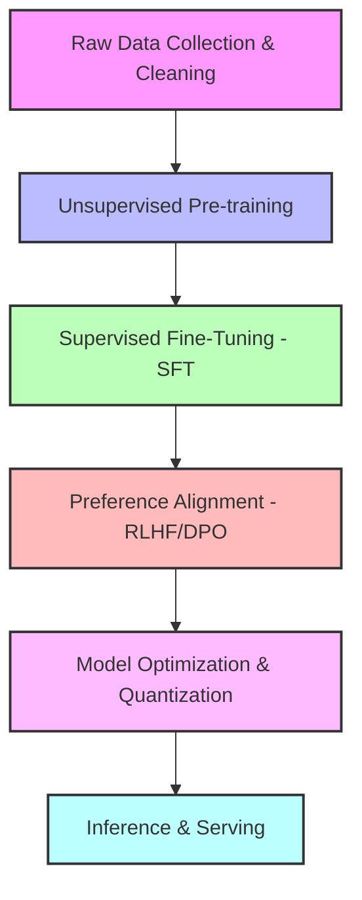

# The LLM Production Pipeline

Developing and deploying a Large Language Model involves a multi-stage engineering pipeline. This guide breaks down the full lifecycle of an LLM, from raw data collection to production deployment.

---

## 1. Data Collection & Preprocessing
The foundation of any language model is its training corpus.
* **Corpus Curation**: Web pages (Common Crawl), books, academic papers, source code repositories, and structured datasets.
* **Filtering & Deduplication**: Removing low-quality pages, boilerplates, spam, and near-duplicate documents (often using MinHash or LSH algorithms) to prevent memorization and improve training efficiency.
* **Toxicity & PII Removal**: Scrubbing personally identifiable information (PII) and highly toxic/offensive content.
* **Tokenization**: Converting raw text into integer IDs using subword algorithms such as Byte-Pair Encoding (BPE) (used by GPT/Llama) or WordPiece (used by BERT).

---

## 2. Pre-training (Unsupervised Learning)
Pre-training requires massive compute clusters (hundreds or thousands of GPUs/TPUs) running for weeks or months.
* **Objective**: Autoregressive next-token prediction.
  $$\mathcal{L} = -\sum_{i=1}^T \log P(w_i \mid w_{1}, \dots, w_{i-1})$$
* **Result**: A "base" or "foundation" model. It understands grammar, syntax, world facts, and code patterns, but functions as a text completer rather than an interactive assistant.

---

## 3. Supervised Fine-Tuning (SFT)
SFT transitions the base model into an instruction-following assistant.
* **Objective**: The model is fine-tuned on high-quality, curated prompt-response pairs (e.g., "Write a Python script to sort a list..." -> Python code).
* **Data Volume**: Typically thousands to tens of thousands of high-quality examples.
* **Formatting**: Formatted using special chat tokens to define roles (e.g., `<|im_start|>system`, `<|im_start|>user`, `<|im_start|>assistant`).

---

## 4. Alignment & Preference Tuning
Alignment ensures the model is helpful, honest, and harmless, reducing toxicity and aligning outputs with human preferences.
* **RLHF (Reinforcement Learning from Human Feedback)**:
  1. Humans rank multiple completions for the same prompt.
  2. A Reward Model is trained to output a score matching human preferences.
  3. The LLM is optimized using PPO against the reward model.
* **DPO (Direct Preference Optimization)**: Bypasses the reward model and reinforcement learning step by training the language model directly on preference pairs (chosen vs. rejected responses) using binary cross-entropy.

---

## 5. Model Compression & Optimization
For efficient deployment, models are optimized to reduce memory footprint and latency.
* **Quantization**: Converting model weights from high-precision floating-point formats (e.g., FP32 or FP16) to lower-precision formats (e.g., FP8, INT8, INT4).
  * **AWQ (Activation-aware Weight Quantization)** and **GPTQ**: Ideal for GPU inference.
  * **GGUF (GPT-Generated Unified Format)**: Ideal for CPU and consumer-grade hardware (macOS/Windows) CPU/GPU offloading.
* **Knowledge Distillation**: Training a smaller "student" model to replicate the behavior and probability distribution of a larger "teacher" model.

---

## 6. Production Inference & Serving
Deploying the model in production requires specialized serving engines to handle concurrent users and reduce cost.
* **Serving Engines**: **vLLM**, **TGI (Text Generation Inference)**, **Ollama**, and **TensorRT-LLM**.
* **KV Caching**: Storing key and value states of previous tokens in memory to avoid redundant attention calculations during token generation.
* **Continuous Batching**: Batching incoming requests at the token level rather than sequence level, maximizing GPU utilization.
* **Speculative Decoding**: Using a small, fast model to generate draft tokens, which are validated in parallel by the larger target model.
