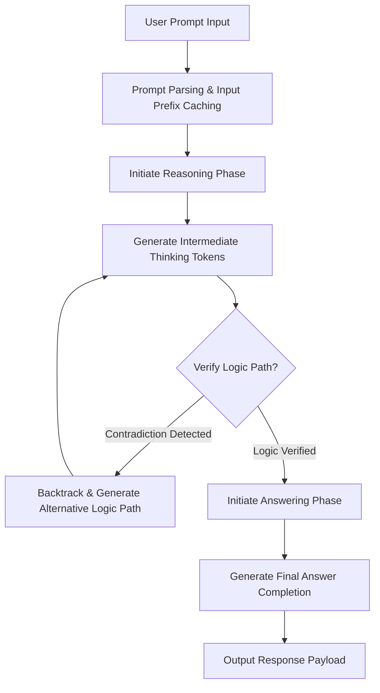

# The Chain of Thought Pipeline

A step-by-step operational breakdown of how a reasoning model processes a user prompt, scales test-time compute, executes self-correction, and compiles the final answer.

---

## 1. Pipeline Execution Flow

This architecture maps the sequential execution flow of reasoning systems:

---

## 2. Step-by-Step Operations

### Step 1: Prompt Parsing & Prefix Caching
* The prompt is ingested and compared against the prefix database cache. If matching system guidelines exist, cache hit discounts are applied.

### Step 2: Intermediate Thinking Token Generation
* The model generates a chain of thought using designated thinking tokens. These tokens are separate from the final visible content and represent the model's internal scratchpad.

### Step 3: Self-Correction Loops & Backtracking
* As the model writes its reasoning path, it checks for mathematical contradictions or syntax bugs. If an error is detected, the model backtracks, generating alternative logic branches.

### Step 4: Visible Answer Generation
* Once the reasoning trace concludes, the model transitions to the answering phase, compiling the final solution in the requested format (plain text, code blocks, etc.).

---

## 3. Hidden Thinking Tokens Architecture

* **Inference Encapsulation**: Thinking tokens are either wrapped in XML tags (e.g. `<think>...</think>`) or returned in a dedicated metadata block (like `reasoning_content`) to prevent them from interfering with user-facing application UI layouts.
* **Context Budget Contribution**: These tokens occupy active context window storage during the generation cycle, contributing to the KV cache footprint.
