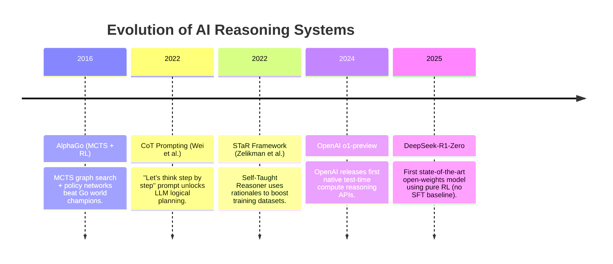

# History of AI Reasoning Models

The development of reasoning models represents the convergence of deep search methods, reinforcement learning algorithms, and large language model architectures.

---

## 1. Timeline of Key Milestones

The historical progression of logic-grounded AI systems:

---

## 2. Deep Search Origins (Pre-LLM Era)

Before LLMs, logical reasoning in AI was managed by search algorithms combined with neural networks:

* **Monte Carlo Tree Search (MCTS)**: Used in systems like AlphaGo (DeepMind, 2016) to explore a tree of potential moves. Combined with reinforcement learning policy networks, this enabled search-based strategic planning.
* **Limitations**: Highly domain-specific (e.g. chess, Go, chess boards). These search structures could not scale to generalized natural language tasks.

---

## 3. The LLM Prompting Era (2022–2023)

As autoregressive transformers (GPT-3/PaLM) scaled:

* **Chain-of-Thought (CoT) Prompting**: Wei et al. (Google, 2022) demonstrated that forcing models to output intermediate reasoning steps (*rationales*) before the final answer significantly increased performance on arithmetic and symbolic tasks.
* **STaR (Self-Taught Reasoner)**: Zelikman et al. (Stanford, 2022) showed that models could generate their own rationales, filter out the incorrect paths based on final answers, and fine-tune on the correct rationales to self-improve.

---

## 4. Native Reinforcement Learning (2024–Present)

The integration of reinforcement learning with LLM training:

* **OpenAI o1**: Released September 2024, demonstrating state-of-the-art performance on competitive programming and PhD-level science logic using undisclosed reinforcement learning methods.
* **DeepSeek-R1-Zero**: Released January 2025, demonstrating that a model trained using **pure reinforcement learning (GRPO)** without a prior Supervised Fine-Tuning (SFT) dataset could discover reasoning, backtracking, and self-correction behaviors completely natively.
