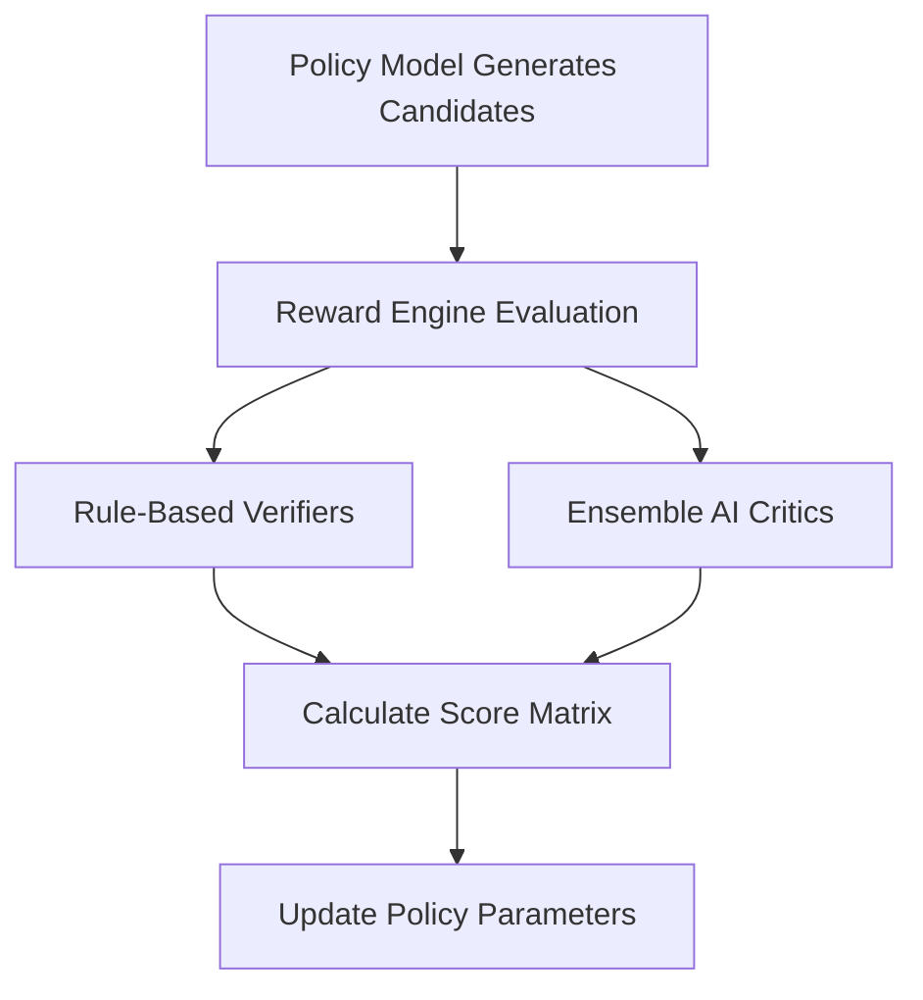

# Reinforcement Learning & RLAIF

**Reinforcement Learning from AI Feedback (RLAIF)** is a training framework that optimizes reasoning models by replacing human annotators with automated critic models and rule-based verification engines. This bypasses human evaluation bottlenecks, allowing developers to generate large-scale logical alignment datasets.

---

## 1. RLAIF Architecture Pipeline

The RLAIF process automates the feedback loop during reinforcement learning training:

---

## 2. Core Reward Engine Components

Reasoning models utilize two primary reward channels to guide policy updates:

### A. Rule-Based Verifiers (Accuracy Rewards)
* **Compiler/Execution Checks**: When evaluating coding solutions, the output code is run in a secure sandbox. If it passes unit tests and compiles successfully, the model receives a positive reward.
* **Math Solver Checks**: Mathematical answers are evaluated against target numerical solutions. If the final value matches, a positive reward is returned.
* **Benefit**: Guarantees objective correctness, eliminating the risk of human evaluators misinterpreting complex proofs.

### B. Ensemble AI Critics (Style & Format Rewards)
* **Formatting Compliance**: AI critics evaluate whether the model adhered to formatting constraints (e.g., placing the thinking trace within `<think>` tags and the final response in JSON/XML).
* **Language Consistency**: Penalizes the model if it switches languages (e.g. Chinese to English) mid-sentence inside the reasoning trace.
* **Helpfulness & Tone**: Scores conversational clarity.

---

## 3. Advantages of RLAIF over RLHF

* **Throughput Scaling**: Generates millions of graded logic paths daily. This is much faster and cheaper than hiring human experts (math PhDs, software engineers) to evaluate reasoning traces.
* **Consistency**: Rule-based code execution guarantees objective verification, eliminating human grading errors or biases.
